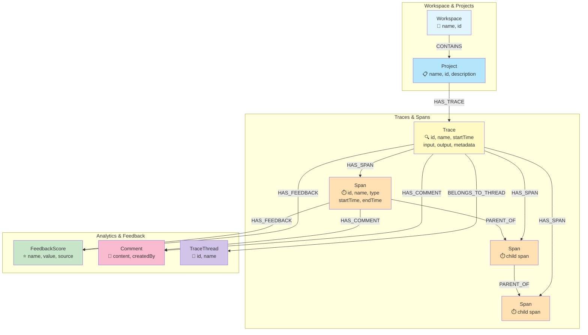
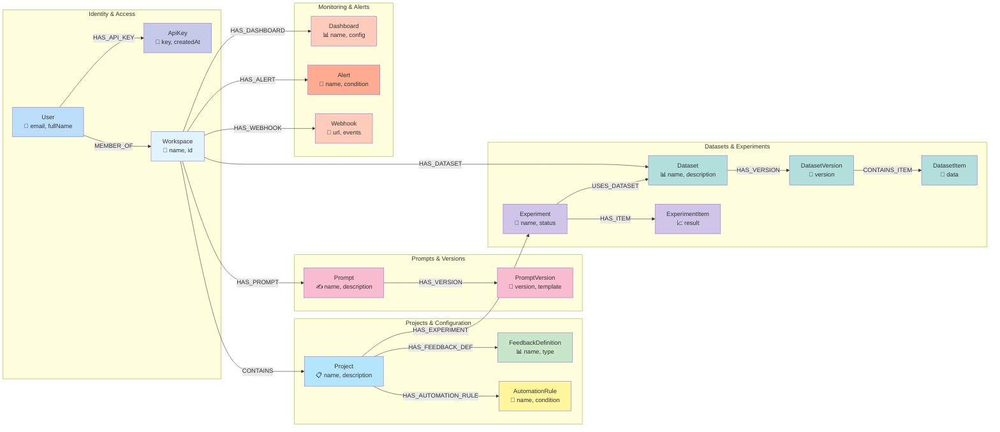
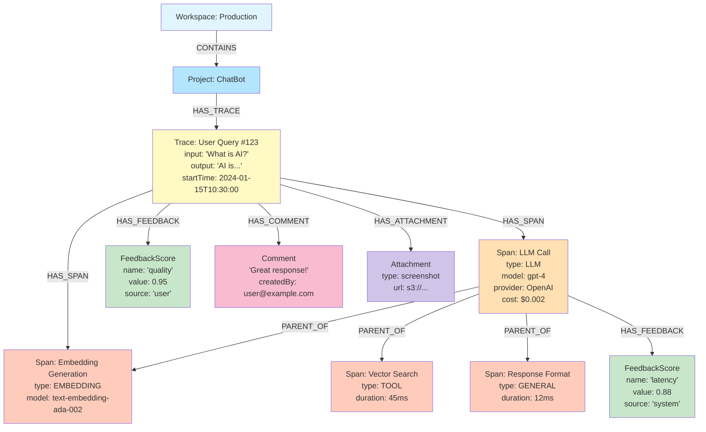

# Opik Neo4j Integration - Quick Start Guide

This repository contains a Neo4j integration for Opik, replacing both MySQL and ClickHouse with a unified graph database.

## 🚀 Quick Start

### Prerequisites
- Docker Desktop installed and running
- Docker signed in (required by organization policy)
- (Optional) Java 21 and Maven for local development

### 1. Start Infrastructure

```bash
./start-neo4j.sh
```

This script will:
- Start Neo4j, Redis, and MinIO services
- Wait for Neo4j to be ready
- Initialize the graph schema (constraints and indexes)
- Display access URLs

### 2. Access Neo4j Browser

Open http://localhost:7474 in your browser:
- **Username**: `neo4j`
- **Password**: `password`

Try running:
```cypher
// Show all node types
MATCH (n) RETURN DISTINCT labels(n) as nodeTypes;

// Show all relationship types
MATCH ()-[r]->() RETURN DISTINCT type(r) as relationshipTypes;

// Visualize schema
CALL db.schema.visualization();
```

### 3. Explore the Schema

The schema is defined in:
```
opik/apps/opik-backend/src/main/resources/neo4j/schema.cypher
```

It includes:
- **Node Types**: Trace, Span, Project, Workspace, User, Dataset, Experiment, etc.
- **Relationships**: HAS_TRACE, HAS_SPAN, PARENT_OF, CONTAINS, etc.
- **Constraints**: Unique constraints on all ID fields
- **Indexes**: Performance indexes on frequently queried properties

## 📊 Graph Data Model

### Core Observability Model

The heart of Opik's observability system is built on a natural graph structure:



### Complete Entity Model



### Trace Hierarchy Example

Here's a concrete example showing how a typical LLM application trace is structured:



### Node Types & Properties

| Node Type | Key Properties | Purpose |
|-----------|---------------|---------|
| **Workspace** | `id`, `name`, `createdAt` | Top-level organization container |
| **User** | `id`, `email`, `fullName` | User identity |
| **ApiKey** | `id`, `key`, `userId` | API authentication |
| **Project** | `id`, `name`, `workspaceId` | Project container for traces |
| **Trace** | `id`, `name`, `projectId`, `startTime`, `endTime`, `input`, `output`, `metadata`, `tags` | Top-level execution trace |
| **Span** | `id`, `name`, `traceId`, `parentSpanId`, `type`, `startTime`, `endTime`, `model`, `provider`, `totalEstimatedCost` | Execution step within trace |
| **TraceThread** | `id`, `name`, `projectId` | Conversation thread grouping |
| **FeedbackScore** | `id`, `name`, `value`, `source` | Evaluation metrics |
| **Comment** | `id`, `content`, `createdBy` | User annotations |
| **Prompt** | `id`, `name`, `description` | Prompt template |
| **PromptVersion** | `id`, `version`, `template` | Versioned prompt content |
| **Dataset** | `id`, `name`, `description` | Test dataset |
| **DatasetVersion** | `id`, `version` | Dataset version |
| **DatasetItem** | `id`, `data` | Individual dataset entry |
| **Experiment** | `id`, `name`, `status` | Evaluation experiment |
| **ExperimentItem** | `id`, `result` | Experiment result |
| **FeedbackDefinition** | `id`, `name`, `type` | Feedback score definition |
| **AutomationRule** | `id`, `name`, `condition` | Automation rule |
| **Dashboard** | `id`, `name`, `config` | Visualization dashboard |
| **Alert** | `id`, `name`, `condition` | Alert configuration |
| **Webhook** | `id`, `url`, `events` | Webhook integration |
| **Attachment** | `id`, `type`, `url` | File attachments |
| **Guardrail** | `id`, `type`, `result` | Safety guardrails |
| **Optimization** | `id`, `type`, `config` | Optimization settings |

### Relationship Types

| Relationship | From → To | Meaning |
|--------------|-----------|---------|
| **CONTAINS** | Workspace → Project | Workspace contains projects |
| **HAS_TRACE** | Project → Trace | Project contains traces |
| **HAS_SPAN** | Trace → Span | Trace contains spans |
| **PARENT_OF** | Span → Span | Parent-child span hierarchy |
| **HAS_FEEDBACK** | Trace/Span → FeedbackScore | Feedback scores attached to traces/spans |
| **HAS_COMMENT** | Trace/Span → Comment | Comments attached to traces/spans |
| **HAS_ATTACHMENT** | Trace/Span → Attachment | File attachments |
| **BELONGS_TO_THREAD** | Trace → TraceThread | Trace belongs to conversation thread |
| **MEMBER_OF** | User → Workspace | User membership |
| **HAS_API_KEY** | User → ApiKey | API key ownership |
| **HAS_PROMPT** | Workspace → Prompt | Prompt ownership |
| **HAS_VERSION** | Prompt/Dataset → Version | Version relationship |
| **HAS_DATASET** | Workspace → Dataset | Dataset ownership |
| **HAS_EXPERIMENT** | Project → Experiment | Experiment in project |
| **USES_DATASET** | Experiment → Dataset | Experiment uses dataset |
| **HAS_ITEM** | Dataset/Experiment → Item | Contains items |
| **HAS_FEEDBACK_DEF** | Project → FeedbackDefinition | Feedback definition |
| **HAS_AUTOMATION_RULE** | Project → AutomationRule | Automation rule |
| **HAS_DASHBOARD** | Workspace → Dashboard | Dashboard configuration |
| **HAS_ALERT** | Workspace → Alert | Alert configuration |
| **HAS_WEBHOOK** | Workspace → Webhook | Webhook integration |

### Query Patterns

**Find all spans in a trace with their hierarchy:**
```cypher
MATCH path = (t:Trace {id: $traceId})-[:HAS_SPAN]->(s:Span)
OPTIONAL MATCH (s)-[:PARENT_OF*]->(child:Span)
RETURN path
```

**Get traces with feedback scores above threshold:**
```cypher
MATCH (p:Project {id: $projectId})-[:HAS_TRACE]->(t:Trace)
MATCH (t)-[:HAS_FEEDBACK]->(fs:FeedbackScore)
WHERE fs.value > 0.9
RETURN t, collect(fs) as scores
ORDER BY t.startTime DESC
```

**Find all experiments using a specific dataset:**
```cypher
MATCH (d:Dataset {id: $datasetId})<-[:USES_DATASET]-(e:Experiment)
MATCH (e)-[:HAS_ITEM]->(ei:ExperimentItem)
RETURN e.name, collect(ei) as results
```

**Trace lineage through prompt versions:**
```cypher
MATCH (t:Trace)-[:USES_PROMPT_VERSION]->(pv:PromptVersion)
MATCH (pv)<-[:HAS_VERSION]-(p:Prompt)
RETURN t.name, p.name, pv.version
ORDER BY t.startTime DESC
```

## 📁 Project Structure

```
.
├── start-neo4j.sh                    # Quick start script
├── NEO4J_INTEGRATION.md              # Comprehensive integration guide
├── NEO4J_ROADMAP.md                  # Implementation roadmap
├── NEO4J_STATUS.md                   # Current status summary
│
├── opik/
│   ├── apps/opik-backend/
│   │   ├── src/main/java/com/comet/opik/
│   │   │   ├── infrastructure/
│   │   │   │   ├── Neo4jConfiguration.java          # Neo4j config class
│   │   │   │   ├── db/
│   │   │   │   │   ├── DatabaseGraphModule.java    # Guice module
│   │   │   │   │   └── Neo4jTransactionTemplate.java # Reactive queries
│   │   │   │   └── health/
│   │   │   │       └── Neo4jHealthCheck.java        # Health endpoint
│   │   │   │
│   │   │   └── domain/
│   │   │       ├── TraceDAONeo4jImpl.java          # Trace operations
│   │   │       ├── SpanDAONeo4jImpl.java           # Span operations
│   │   │       └── ProjectDAONeo4jImpl.java        # Project operations
│   │   │
│   │   ├── src/main/resources/neo4j/
│   │   │   └── schema.cypher                       # Graph schema
│   │   │
│   │   ├── src/test/java/.../infrastructure/db/
│   │   │   ├── Neo4jIntegrationTest.java          # Integration tests
│   │   │   └── Neo4jPerformanceTest.java          # Performance tests
│   │   │
│   │   ├── pom.xml                                 # Updated dependencies
│   │   └── config.yml                              # Neo4j configuration
│   │
│   └── deployment/docker-compose/
│       ├── docker-compose.yaml                     # Neo4j service
│       └── docker-compose.override.yaml            # Port mappings
```

## 🎯 Implementation Status

### ✅ Completed (Foundation)
- [x] Dependencies & configuration
- [x] Docker Compose setup
- [x] Core infrastructure (Module, Transaction Template)
- [x] Schema design (constraints & indexes)
- [x] TraceDAO implementation
- [x] SpanDAO implementation
- [x] ProjectDAO implementation
- [x] Health check
- [x] Integration tests with Testcontainers
- [x] Performance benchmarks
- [x] Comprehensive documentation

### 🚧 In Progress (Remaining Work)
- [ ] ~20 additional DAO implementations (see NEO4J_ROADMAP.md)
- [ ] Service layer updates
- [ ] Complete test coverage
- [ ] Production readiness

**Current Status**: Foundation complete, ~70% of DAOs remaining

See [NEO4J_ROADMAP.md](NEO4J_ROADMAP.md) for detailed implementation plan.

## 🏗️ Architecture

### Before (MySQL + ClickHouse)
```
┌─────────────┐     ┌──────────────┐
│    MySQL    │     │  ClickHouse  │
│   (State)   │     │ (Analytics)  │
└─────────────┘     └──────────────┘
      ↑                    ↑
      └────────┬───────────┘
               │
         ┌─────────┐
         │ Backend │
         └─────────┘
```

### After (Neo4j Only)
```
     ┌─────────────────┐
     │     Neo4j       │
     │  (Unified DB)   │
     └─────────────────┘
              ↑
         ┌─────────┐
         │ Backend │
         └─────────┘
```

**Benefits:**
- Single database to manage
- Natural graph relationships
- Flexible schema evolution
- Powerful Cypher queries
- Built-in graph algorithms

## 📖 Documentation

- **[NEO4J_INTEGRATION.md](NEO4J_INTEGRATION.md)** - Complete integration guide
  - Architecture overview
  - Graph data model
  - Configuration details
  - Code examples
  - Performance tuning
  - Migration strategy

- **[NEO4J_ROADMAP.md](NEO4J_ROADMAP.md)** - Implementation roadmap
  - Remaining work breakdown
  - Priority levels
  - Implementation patterns
  - Testing strategy
  - Timeline estimates

- **[NEO4J_STATUS.md](NEO4J_STATUS.md)** - Current status
  - Completed work
  - Known issues
  - Files created/modified

## 🧪 Testing

### Integration Tests (Testcontainers)
```bash
cd opik/apps/opik-backend
mvn test -Dtest=Neo4jIntegrationTest
```

Tests verify:
- Neo4j connectivity
- Trace/Span creation
- Relationship traversal
- Constraint enforcement
- Index usage

### Performance Tests
```bash
mvn test -Dtest=Neo4jPerformanceTest
```

Benchmarks:
- Batch insert throughput (1000+ traces/sec)
- Indexed query performance (<1s for 10K records)
- Relationship traversal speed
- Update operations

## 🔧 Development

### Building the Backend

Requires Java 21 and Maven:
```bash
cd opik/apps/opik-backend
mvn clean install -DskipTests
```

### Running Tests
```bash
# All tests
mvn test

# Specific test class
mvn test -Dtest=Neo4jIntegrationTest

# With coverage
mvn test -Pcoverage
```

### Implementing a New DAO

1. **Find the interface** (e.g., `WorkspaceDAO.java`)
2. **Create implementation** (e.g., `WorkspaceDAONeo4jImpl.java`):

```java
@Slf4j
@Singleton
@RequiredArgsConstructor(onConstructor_ = @Inject)
public class WorkspaceDAONeo4jImpl {
    
    private final Neo4jTransactionTemplate neo4jTemplate;
    
    public Mono<Workspace> save(Workspace workspace) {
        String cypher = """
                MERGE (w:Workspace {id: $id})
                ON CREATE SET w.name = $name, w.createdAt = datetime($createdAt)
                RETURN w
                """;
        
        Map<String, Object> params = Map.of(
            "id", workspace.getId().toString(),
            "name", workspace.getName(),
            "createdAt", Instant.now().toString()
        );
        
        return neo4jTemplate.executeWrite(cypher, params, this::mapToWorkspace);
    }
    
    private Workspace mapToWorkspace(org.neo4j.driver.Record record) {
        var node = record.get("w").asNode();
        return Workspace.builder()
                .id(UUID.fromString(node.get("id").asString()))
                .name(node.get("name").asString())
                .build();
    }
}
```

3. **Update interface** binding:
```java
@ImplementedBy(WorkspaceDAONeo4jImpl.class)
public interface WorkspaceDAO {
    // ... methods
}
```

4. **Add tests**

See [NEO4J_ROADMAP.md](NEO4J_ROADMAP.md) for detailed patterns and examples.

## 🐛 Troubleshooting

### Docker Not Running
```bash
# Start Docker Desktop
open -a Docker

# Wait for it to start, then retry
./start-neo4j.sh
```

### Neo4j Won't Start
```bash
# Check logs
cd opik/deployment/docker-compose
docker-compose logs neo4j

# Restart service
docker-compose restart neo4j
```

### Schema Not Initialized
```bash
# Manually run schema
cat opik/apps/opik-backend/src/main/resources/neo4j/schema.cypher | \
docker-compose exec -T neo4j cypher-shell -u neo4j -p password
```

### Build Errors
```bash
# Clean and rebuild
cd opik/apps/opik-backend
mvn clean install -DskipTests
```

## 🔗 Useful Neo4j Queries

```cypher
// Count all nodes by type
MATCH (n)
RETURN labels(n) as type, count(n) as count
ORDER BY count DESC;

// Show all relationships
MATCH ()-[r]->()
RETURN type(r) as relationship, count(r) as count
ORDER BY count DESC;

// Find traces with their spans
MATCH (t:Trace)-[:HAS_SPAN]->(s:Span)
RETURN t, s
LIMIT 10;

// Show project hierarchy
MATCH (w:Workspace)-[:CONTAINS]->(p:Project)-[:HAS_TRACE]->(t:Trace)
RETURN w.name, p.name, count(t) as traceCount;
```

## 📚 Additional Resources

- [Neo4j Java Driver Documentation](https://neo4j.com/docs/java-manual/current/)
- [Cypher Query Language](https://neo4j.com/docs/cypher-manual/current/)
- [Neo4j Performance Tuning](https://neo4j.com/docs/operations-manual/current/performance/)
- [Project Reactor Documentation](https://projectreactor.io/docs/core/release/reference/)

## 🤝 Contributing

To contribute to completing the integration:

1. Review [NEO4J_ROADMAP.md](NEO4J_ROADMAP.md) for available work
2. Pick a DAO from Priority 1, 2, or 3
3. Follow the implementation pattern
4. Add comprehensive tests
5. Update documentation

## 📝 License

Same as the main Opik project.

## 🙏 Acknowledgments

This integration was designed to provide:
- Simplified architecture (one database instead of two)
- Natural graph relationships for traces and spans
- Flexible schema for future enhancements
- Better support for graph analytics

---

**Status**: Foundation Complete | **Next**: Priority 1 DAOs | **Target**: Full Production Ready

For questions or issues, refer to the comprehensive documentation in this repository.

